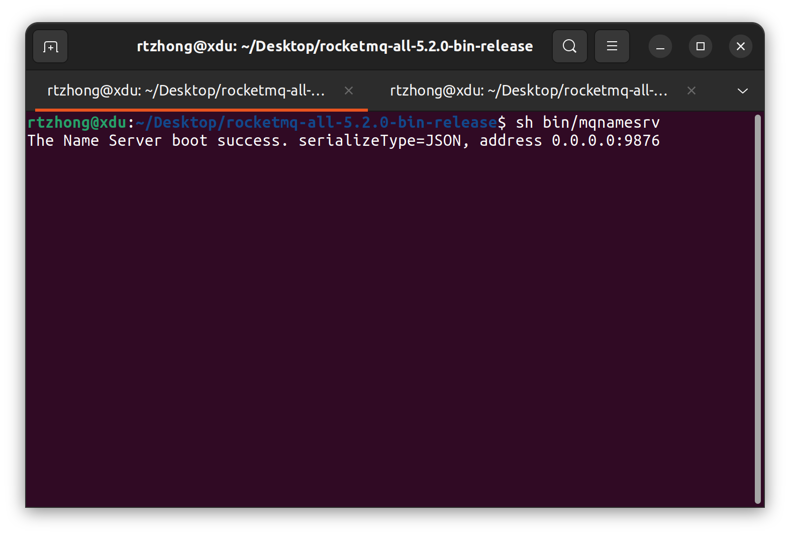
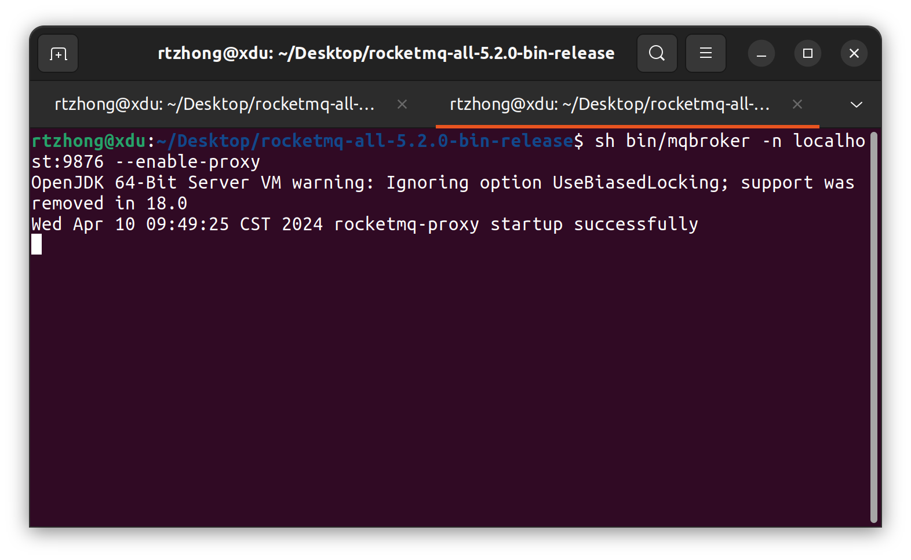
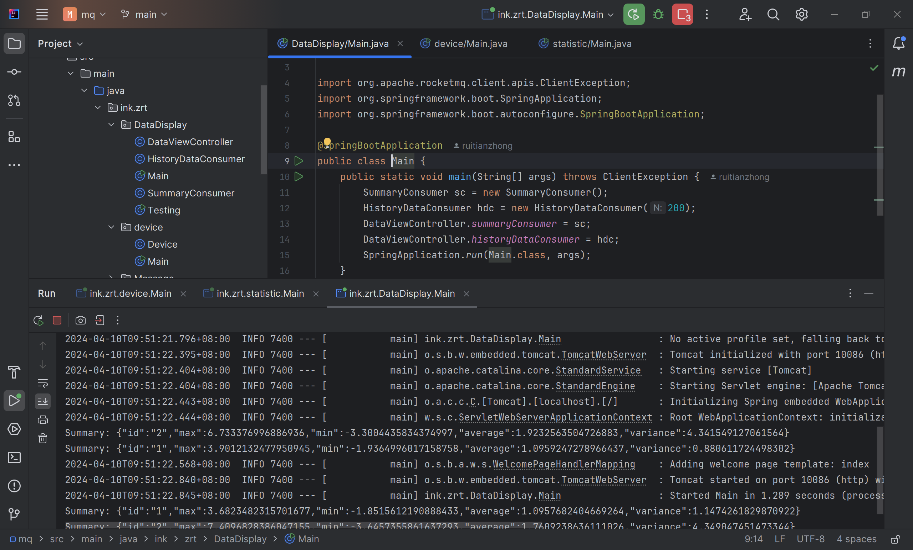
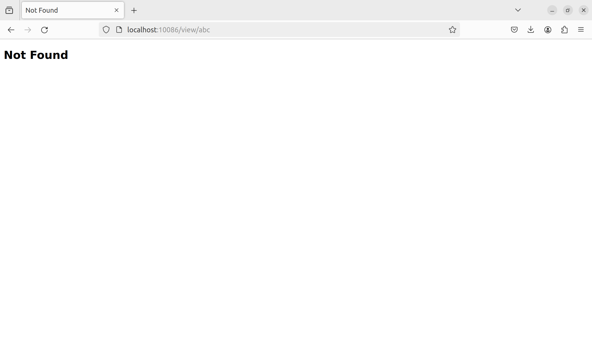
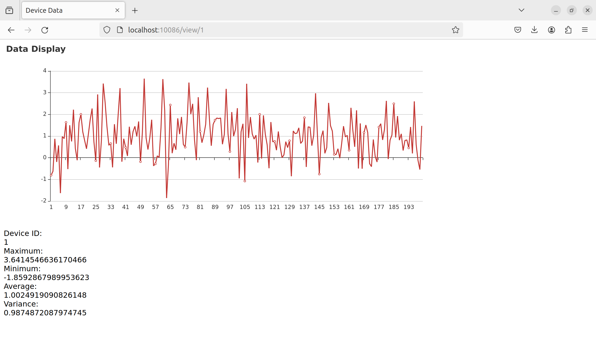
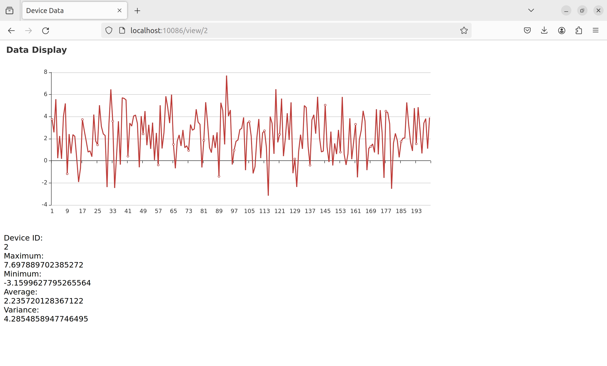
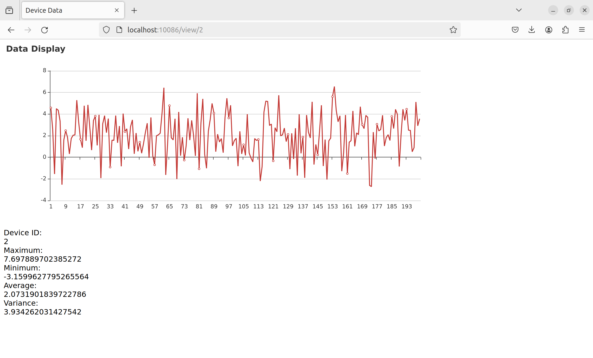

## Setup Topic for RocketMQ

```bash
sh bin/mqnamesrv
sh bin/mqbroker -n localhost:9876 --enable-proxy 
bin/mqadmin updatetopic -n localhost:9876 -t statistic -c DefaultCluster
bin/mqadmin updatetopic -n localhost:9876 -t device -c DefaultCluster
```

## Project Structure

```text
.
├── pom.xml
├── README.md
└── src
    ├── main
    │   ├── java
    │   │   └── ink
    │   │       └── zrt
    │   │           ├── DataDisplay
    │   │           │   ├── DataViewController.java
    │   │           │   ├── HistoryDataConsumer.java
    │   │           │   ├── Main.java
    │   │           │   ├── SummaryConsumer.java
    │   │           │   └── Testing.java
    │   │           ├── device
    │   │           │   ├── Device.java
    │   │           │   └── Main.java
    │   │           ├── Main.java
    │   │           ├── Message
    │   │           │   ├── DeviceMessage.java
    │   │           │   └── StatisticMessage.java
    │   │           ├── statistic
    │   │           │   ├── Main.java
    │   │           │   └── StatisticCalculator.java
    │   │           └── utils
    │   │               ├── ConsumerHandler.java
    │   │               ├── WrappedConsumer.java
    │   │               └── WrappedProducer.java
    │   └── resources
    │       ├── application.properties
    │       └── templates
    │           ├── 404.html
    │           └── index.html
    └── test
        └── java

14 directories, 20 files

```

## Preview

+ Start the name server



+ Start the proxy



+ Start the application within IDEA



+ Query the device id (abc) that did not exist



+ Query the device id (1)



+ Query the device id (2)



+ Refresh the data from device id (2)


